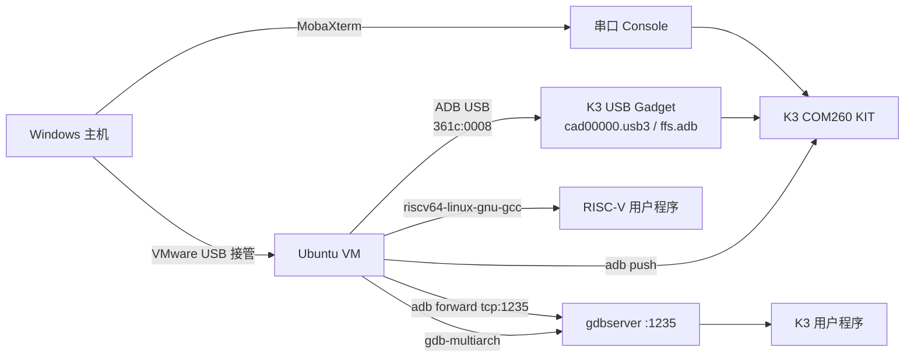
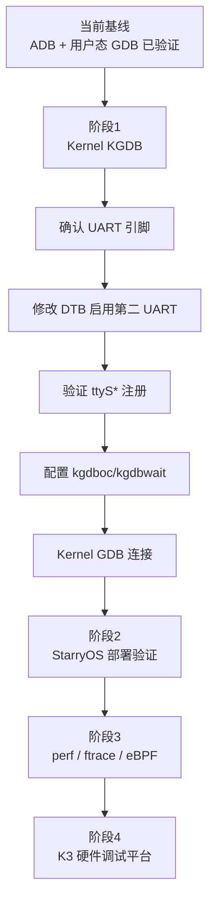

# K3 COM260 KIT 当前验证状态报告

## 文档信息

| 项目 | 内容 |
|---|---|
| 项目名称 | K3 COM260 KIT 调试器硬件部署项目 |
| 文档用途 | 记录当前已经验证的调试能力、运行状态、证据边界和后续验证入口 |
| 整理日期 | 2026-07-26 |
| 目标硬件 | SpacemiT K3 COM260 KIT |
| 当前系统 | Bianbu 4.0 |
| 当前内核 | Linux 6.18.3-generic，riscv64 |
| 当前启动介质 | NOR boot |
| 当前 rootfs | ext4 |
| 证据范围 | 仅使用本项目已提供的命令、输出和实验结论 |

## 状态标记

| 标记 | 含义 |
|---|---|
| ✅ 已验证 | 已有实际命令、输出或成功操作支撑 |
| 🟡 当前可用但有限制 | 功能已工作，但存在环境、可靠性或使用范围限制 |
| ⏳ 未完成 | 尚未完成配置或实验验证 |
| 📌 后续计划 | 已明确的下一阶段工作，不代表已经实现 |

## 目录

1. [总体结论](#1-总体结论)
2. [系统与硬件基线](#2-系统与硬件基线)
3. [USB Gadget 与 ADB 状态](#3-usb-gadget-与-adb-状态)
4. [Windows ADB 验证](#4-windows-adb-验证)
5. [Ubuntu VMware USB 接管](#5-ubuntu-vmware-usb-接管)
6. [RISC-V 用户态远程调试链](#6-risc-v-用户态远程调试链)
7. [当前调试架构](#7-当前调试架构)
8. [网络状态](#8-网络状态)
9. [Boot 环境备份](#9-boot-环境备份)
10. [设备树与串口状态](#10-设备树与串口状态)
11. [Kernel KGDB 状态](#11-kernel-kgdb-状态)
12. [完整验证矩阵](#12-完整验证矩阵)
13. [当前限制与未完成事项](#13-当前限制与未完成事项)
14. [后续路线图](#14-后续路线图)
15. [后续实验基线要求](#15-后续实验基线要求)

## 1. 总体结论

当前已经建立并验证以下主机到 K3 的调试能力：

```text
Ubuntu VMware
    │
    ├─ RISC-V 交叉编译
    ├─ ADB USB 连接与文件传输
    ├─ adb forward TCP 端口转发
    └─ gdb-multiarch
             │
             ▼
K3 Bianbu 4.0 / Linux 6.18.3 riscv64
    │
    └─ gdbserver
             │
             ▼
       RISC-V 用户程序
```

### 已验证事实

- ✅ K3 USB Device Controller 已注册为 `cad00000.usb3`。
- ✅ USB gadget `g1` 已绑定 ADB FunctionFS 功能。
- ✅ Windows 官方 platform-tools 可识别设备并进入 root shell。
- ✅ VMware Ubuntu 可接管 USB 设备并通过 ADB 管理 K3。
- ✅ Ubuntu 已具备 RISC-V 交叉编译和 `gdb-multiarch` 环境。
- ✅ K3 已安装并运行 riscv64 `gdbserver`。
- ✅ 已完成断点、单步、变量、寄存器、反汇编和线程检查。
- ✅ `/boot` 已打包并成功拉取至 Ubuntu。
- ✅ 当前 console UART 已定位为 `serial@d4017000` / `ttyS0`。
- ✅ 内核配置包含 KGDB、KGDB serial console、KDB、debug info 和 Magic SysRq。

### 当前状态

- 🟡 用户态 RISC-V 远程调试链完整可用。
- 🟡 ADB 可通过 Windows 或 Ubuntu VM 使用；USB 设备需要由目标主机/虚拟机接管。
- 🟡 网络当前不可达，软件包和文件主要依靠 Ubuntu 下载后经 ADB 转移。
- 🟡 Kernel 具备 KGDB编译能力，但运行时未启用 `kgdboc`。

### 尚未完成

- ⏳ 未建立第二 UART 作为独立 KGDB通道。
- ⏳ 未验证 `kgdboc`、`kgdbwait` 和 kernel GDB连接。
- ⏳ 未完成 USB 网络或 Wi-Fi联网。
- ⏳ 未开展 StarryOS 部署验证。
- ⏳ 未开展 perf、ftrace、eBPF动态跟踪验证。

## 2. 系统与硬件基线

| 项目 | 已知状态 | 验证等级 |
|---|---|---|
| 开发板 | SpacemiT K3 COM260 KIT | ✅ 已确认 |
| 发行版 | Bianbu 4.0 | ✅ 已确认 |
| Kernel | Linux 6.18.3-generic | ✅ 由 `uname` 输出确认 |
| 架构 | riscv64 | ✅ 由 `uname` 输出确认 |
| rootfs | ext4 | ✅ 已确认 |
| 启动方式 | NOR boot | ✅ 已确认 |
| U-Boot 环境 | 存在 | ✅ 已确认 |
| Windows工具 | Google 官方 platform-tools、MobaXterm | ✅ 已使用 |
| Ubuntu环境 | VMware Ubuntu | ✅ 已使用 |

基线识别输出：

```text
whoami
root

uname
Linux k3
6.18.3-generic
riscv64
```

> 边界说明：当前上下文未提供更完整的 `uname -a`、板卡 revision、DDR/UFS型号、U-Boot版本、DTB hash或内核构建 hash，本报告不补充这些信息。

## 3. USB Gadget 与 ADB 状态

### 3.1 USB Device Controller

检查位置：

```bash
ls /sys/class/udc
```

已验证输出：

```text
cad00000.usb3
```

结论：

- ✅ K3 USB Device Controller 已被 Linux 注册。
- ✅ 当前存在可供 USB gadget绑定的 UDC。

### 3.2 Gadget 配置

Gadget 路径：

```text
/sys/kernel/config/usb_gadget/g1
```

当前配置：

| 配置项 | 当前值 | 状态 |
|---|---|---|
| UDC | `cad00000.usb3` | ✅ 已绑定 |
| Function | `ffs.adb` | ✅ 存在 |
| Configuration | `c.1` | ✅ 存在 |
| idVendor | `0x361c` | ✅ 已确认 |
| idProduct | `0x0008` | ✅ 已确认 |

### 3.3 ADB daemon 与 FunctionFS

ADB进程路径：

```text
/usr/lib/android-sdk/platform-tools/adbd
```

FunctionFS挂载路径：

```text
/dev/usb-ffs/adb
```

已存在 endpoint：

```text
ep0
ep1
ep2
```

结论：

- ✅ `adbd` 进程存在。
- ✅ ADB FunctionFS endpoint 已建立。
- ✅ K3 USB gadget ADB功能已经完成主机侧联调验证。

## 4. Windows ADB 验证

### 4.1 设备枚举

Windows使用 Google 官方 platform-tools：

```powershell
.\adb.exe devices
```

已验证结果：

```text
COM3K3081280112 device
```

### 4.2 Shell 与权限

```powershell
.\adb.exe shell
```

进入 K3 后确认：

```text
whoami: root
Kernel: Linux 6.18.3-generic
Architecture: riscv64
```

### 4.3 文件传输

- ✅ `adb push` 已成功完成文件上传。
- ✅ Windows到 K3 的控制与文件通道可用。

## 5. Ubuntu VMware USB 接管

### 5.1 USB枚举

USB设备转移到 Ubuntu VM 后：

```bash
lsusb
```

已验证设备：

```text
361c:0008 SpacemiT ADB device
```

VID/PID 与 K3 gadget配置一致：

```text
idVendor  = 0x361c
idProduct = 0x0008
```

### 5.2 ADB权限问题及处理

初始状态：

```text
no permissions
```

处理内容：

1. 创建规则文件：

   ```text
   /etc/udev/rules.d/51-android.rules
   ```

2. 重新加载规则并触发设备处理：

   ```bash
   udevadm control --reload-rules
   udevadm trigger
   ```

3. 确认当前用户属于：

   ```text
   plugdev
   ```

最终结果：

```bash
adb devices
```

```text
COM3K3081280112 device
```

```bash
adb shell
```

- ✅ Ubuntu VM能够直接进入 K3。
- ✅ Ubuntu VM已成为当前主要 ADB、编译和 GDB工作环境。

## 6. RISC-V 用户态远程调试链

### 6.1 Ubuntu 工具

| 工具 | 状态 | 已知版本/用途 |
|---|---|---|
| `gdb-multiarch` | ✅ 已安装 | GNU gdb 15.1 |
| `gcc-riscv64-linux-gnu` | ✅ 已安装 | RISC-V Linux交叉编译 |
| `adb` | ✅ 已安装并可访问 K3 | 设备管理、传输、端口转发 |

### 6.2 K3 gdbserver

安装包：

```text
gdbserver_17.1-2ubuntu1bb2_riscv64.deb
```

部署过程：

```text
Ubuntu下载 deb
    -> adb push 到 K3 /tmp/
    -> K3 执行 apt install
```

验证：

```bash
which gdbserver
```

```text
/usr/bin/gdbserver
```

版本信息：

```text
GNU gdbserver 17.1
configured as riscv64-linux-gnu
```

### 6.3 测试程序

`test.c` 的已知逻辑：

```text
a = 10
b = 20
c = a + b
```

交叉编译命令：

```bash
riscv64-linux-gnu-gcc -g test.c -o test
```

部署：

```bash
adb push test /root/
```

### 6.4 gdbserver 与端口转发

K3执行：

```bash
gdbserver :1235 ./test
```

Ubuntu建立 ADB转发：

```bash
adb forward tcp:1235 tcp:1235
```

Ubuntu启动调试器：

```bash
gdb-multiarch ./test
```

GDB连接：

```gdb
target remote localhost:1235
```

### 6.5 已通过的调试能力

```gdb
break main
next
print a
print b
print c
info registers
disassemble main
info threads
```

验证结果：

| 能力 | 结果 |
|---|---|
| 连接远程目标 | ✅ 成功 |
| `break main` | ✅ 命中 `test.c:5` |
| 变量查看 | ✅ `a`、`b`、`c` 可查看 |
| 源码单步 | ✅ `next` 成功 |
| 寄存器检查 | ✅ 成功 |
| 反汇编 | ✅ 成功 |
| 线程检查 | ✅ 成功 |

结论：

> ✅ Windows/VMware/K3硬件组合下，Ubuntu到 K3用户程序的完整 RISC-V远程调试链已经建立。

## 7. 当前调试架构



硬件和工具职责：

| 位置 | 当前职责 | 状态 |
|---|---|---|
| Windows | VMware宿主、MobaXterm串口 console | ✅ 已使用 |
| USB-C连接 | K3 USB gadget/ADB物理链路 | ✅ 已验证 |
| Ubuntu VM | ADB、GDB、交叉编译、软件包下载 | ✅ 已验证 |
| K3 Linux | `adbd`、`gdbserver`、测试程序运行 | ✅ 已验证 |
| 当前 console UART | `ttyS0` / `serial@d4017000` | ✅ 已验证 |

## 8. 网络状态

K3 `ip addr` 当前只观察到：

```text
lo
end1 DOWN
wlP4p1s0 DOWN
```

验证结果：

- ⏳ `ping` 网络不可达。
- ⏳ K3无法直接访问 `archive.spacemit.com`。
- 🟡 当前软件包部署可采用“Ubuntu下载 → ADB push → K3本地安装”。

待选网络方案：

1. 📌 USB网络；
2. 📌 Wi-Fi；
3. 📌 继续使用 Ubuntu离线下载和 ADB转移。

> 尚未提供 USB网络或 Wi-Fi成功记录，因此本报告不指定默认联网方案。

## 9. Boot 环境备份

K3创建工作目录：

```bash
mkdir /tmp/boot_backup
```

打包 `/boot`：

```bash
tar czvf /tmp/boot_backup.tar.gz /boot
```

当前结果：

| 项目 | 状态 |
|---|---|
| 压缩包 | `/tmp/boot_backup.tar.gz` |
| 大小 | 45M |
| Ubuntu `adb pull` | ✅ 成功 |

结论：

- ✅ 当前 `/boot` 环境已有主机侧备份。
- 🟡 上下文未提供压缩包 hash、恢复演练或 NOR完整镜像备份记录，因此不能宣称已经具备完整启动介质恢复能力。

## 10. 设备树与串口状态

### 10.1 DTB来源与保存

当前运行时设备树来源：

```text
/sys/firmware/fdt
```

已保存：

```text
/tmp/current.dtb
```

分析文件：

```text
k3_runtime.dts
```

### 10.2 当前 console

设备树节点：

```text
serial@d4017000
```

Linux设备：

```text
ttyS0
```

`/proc/tty/driver/serial` 已观察到：

```text
0: uart:XScale mmio:0xD4017000
```

结论：

- ✅ `serial@d4017000` 与 `ttyS0`/当前 console关系已确认。
- ✅ 当前 console工作正常。

### 10.3 其他 UART节点

DTB中存在但均禁用：

```text
serial@f0612000  status="disabled"
serial@d4017100  status="disabled"
serial@d4017200  status="disabled"
```

- ⏳ 当前没有发现已经启用、可直接分配给 KGDB的第二 UART。
- ⏳ `/proc/tty/driver/serial` 的其他项为 unknown，不能据此认定存在可用串口。

## 11. Kernel KGDB 状态

### 11.1 编译配置

已确认内核配置：

```text
CONFIG_KGDB=y
CONFIG_KGDB_SERIAL_CONSOLE=y
CONFIG_KGDB_KDB=y
CONFIG_DEBUG_INFO=y
CONFIG_MAGIC_SYSRQ=y
```

结论：

- ✅ 当前内核包含 KGDB核心支持。
- ✅ 包含 KGDB serial console、KDB、debug info和 Magic SysRq支持。

### 11.2 运行状态

检查位置：

```text
/sys/module/kgdboc/parameters/kgdboc
```

当前值：

```text
空
```

工程判定：

- 🟡 内核“编译支持 KGDB”。
- ⏳ 当前没有配置 KGDB over console。
- ⏳ 尚未验证 `kgdbwait`。
- ⏳ 尚未建立 kernel GDB远程连接。

### 11.3 KGDB当前阻塞项

1. 确认 COM260 KIT可用 UART引脚；
2. 修改 DTB启用目标 UART；
3. 验证新增串口注册为预期的 `ttyS*`；
4. 配置 `kgdboc`；
5. 配置并验证 `kgdbwait`；
6. 准备与运行内核匹配的符号文件；
7. 从开发主机完成 kernel GDB连接。

> 第 6 项是建立有源码符号调试所需的工程输入，但当前上下文未提供具体符号文件路径或版本，故只列为待准备事项。

## 12. 完整验证矩阵

| 编号 | 验证项 | 状态 | 直接证据/结果 |
|---:|---|---|---|
| 1 | K3系统启动 | ✅ | Bianbu 4.0、Linux 6.18.3-generic riscv64 |
| 2 | USB UDC | ✅ | `/sys/class/udc` → `cad00000.usb3` |
| 3 | Gadget ADB配置 | ✅ | `g1`、`ffs.adb`、`c.1`、VID/PID |
| 4 | FunctionFS endpoints | ✅ | `/dev/usb-ffs/adb/ep0..ep2` |
| 5 | Windows ADB枚举 | ✅ | `COM3K3081280112 device` |
| 6 | Windows root shell | ✅ | `whoami` → `root` |
| 7 | Windows文件上传 | ✅ | `adb push` 成功 |
| 8 | Ubuntu USB枚举 | ✅ | `361c:0008 SpacemiT ADB device` |
| 9 | Ubuntu ADB权限 | ✅ | udev规则 + `plugdev` 后恢复 |
| 10 | Ubuntu ADB shell | ✅ | 成功进入 K3 |
| 11 | RISC-V交叉编译 | ✅ | `gcc-riscv64-linux-gnu` |
| 12 | K3 gdbserver | ✅ | `/usr/bin/gdbserver` 17.1 riscv64 |
| 13 | ADB TCP转发 | ✅ | `tcp:1235` → `tcp:1235` |
| 14 | GDB远程连接 | ✅ | `target remote localhost:1235` |
| 15 | 用户态断点与单步 | ✅ | `break main` 命中 `test.c:5`，`next`成功 |
| 16 | 变量/寄存器/反汇编/线程 | ✅ | 相应 GDB命令全部成功 |
| 17 | `/boot` 备份 | ✅ | 45M tar.gz并已 `adb pull` |
| 18 | 当前 console UART定位 | ✅ | `serial@d4017000` / `ttyS0` |
| 19 | KGDB内核配置 | ✅ | KGDB、KDB、debug info、SysRq均启用 |
| 20 | KGDB运行时配置 | ⏳ | `kgdboc` 参数为空 |
| 21 | 第二 UART | ⏳ | 候选节点均 disabled |
| 22 | K3网络 | ⏳ | `end1`、`wlP4p1s0` DOWN，ping不可达 |
| 23 | StarryOS部署 | ⏳ | 尚未执行 |
| 24 | perf/ftrace/eBPF | ⏳ | 尚未执行 |

## 13. 当前限制与未完成事项

### 13.1 调试链限制

- 用户态 GDB链已经可用，kernel KGDB链尚未建立。
- 当前 `ttyS0` 同时承担 console职责，没有已验证的第二 UART。
- USB设备在 Windows与 VMware Ubuntu之间的归属需要正确切换。

### 13.2 网络限制

- K3当前没有可用外部网络接口。
- K3无法在线访问软件源。
- 软件包安装依赖 Ubuntu侧下载和 ADB转移。

### 13.3 恢复能力限制

- 已备份 `/boot`，但没有完整 NOR备份记录。
- 没有提供备份 hash或恢复演练结果。

### 13.4 尚未开始的目标

- StarryOS部署验证；
- perf；
- ftrace；
- eBPF；
- 完整 K3硬件调试平台封装。

## 14. 后续路线图



### 阶段1：Kernel KGDB

目标：建立独立于用户态 `gdbserver` 的内核级断点和源码调试链。

完成判据：

- 第二 UART物理连接和设备树关系明确；
- 对应 `ttyS*` 稳定注册；
- `kgdboc` 非空且与目标串口一致；
- `kgdbwait` 能停住内核；
- 主机 GDB能连接并进行最小断点/继续操作。

### 阶段2：StarryOS部署验证

目标：在当前硬件和主机调试基础上开展 StarryOS部署。

当前状态：⏳ 未开始。

### 阶段3：动态跟踪

目标项：

- perf；
- ftrace；
- eBPF。

当前状态：⏳ 均未开始，不声明支持状态。

### 阶段4：K3硬件调试平台

目标：把串口、ADB、用户态 GDB、Kernel KGDB、系统部署和动态跟踪形成统一硬件调试平台。

当前状态：📌 规划阶段。

## 15. 后续实验基线要求

后续实验应保留以下已验证基线，不应在未备份情况下直接替换：

1. K3可正常启动 Bianbu 4.0 / Linux 6.18.3-generic；
2. `cad00000.usb3` UDC和 `g1/ffs.adb` gadget配置；
3. 设备序列号 `COM3K3081280112`；
4. Ubuntu udev规则和 `plugdev` 权限配置；
5. `gdb-multiarch 15.1` 与 K3 `gdbserver 17.1`；
6. 已验证的 ADB端口转发 `tcp:1235`；
7. `/boot` 备份 `/tmp/boot_backup.tar.gz` 的主机副本；
8. 当前运行时 DTB副本 `/tmp/current.dtb` 与分析文件 `k3_runtime.dts`；
9. 当前 console `ttyS0` / `serial@d4017000`；
10. 修改 DTB、boot参数或 kernel前记录原始文件和恢复方式。

每轮新实验至少应记录：

| 类别 | 必须记录的信息 |
|---|---|
| 硬件 | 板卡、连接方式、USB归属、目标 UART |
| 软件 | OS、Kernel、DTB、工具版本 |
| 命令 | 主机端与 K3端完整命令 |
| 输出 | 关键原始输出和失败信息 |
| 产物 | 二进制、配置、备份路径及可用时的 hash |
| 结果 | 已验证、失败、未执行，不得混用 |

---

本报告定义了当前实验基线：**ADB与 RISC-V用户态远程调试已验证；Kernel KGDB仅具备编译配置，运行链未建立；网络、StarryOS和动态跟踪仍待后续实验。**
