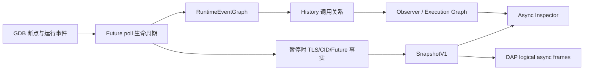
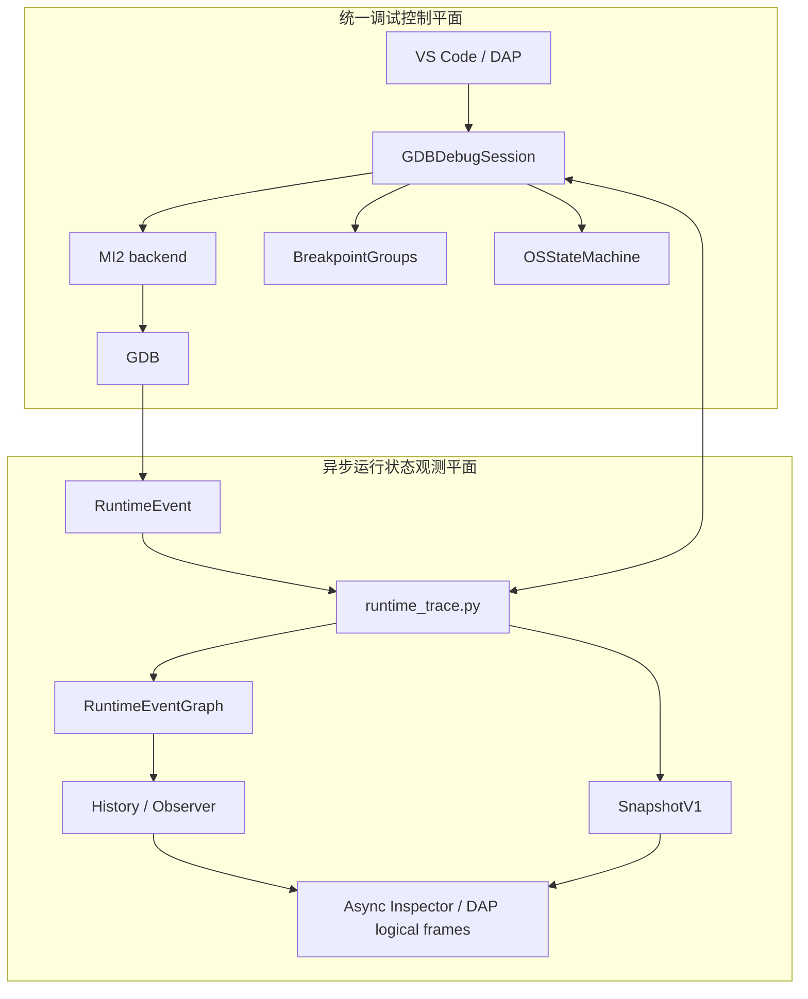
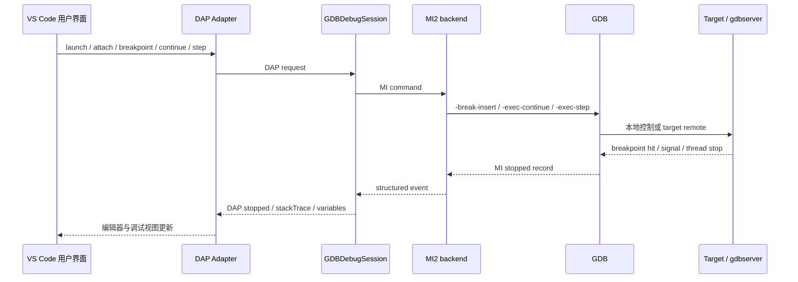
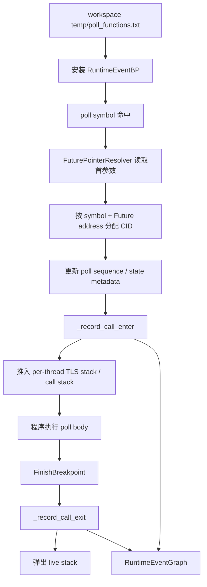
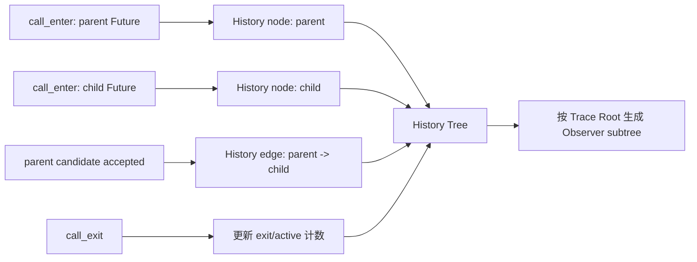
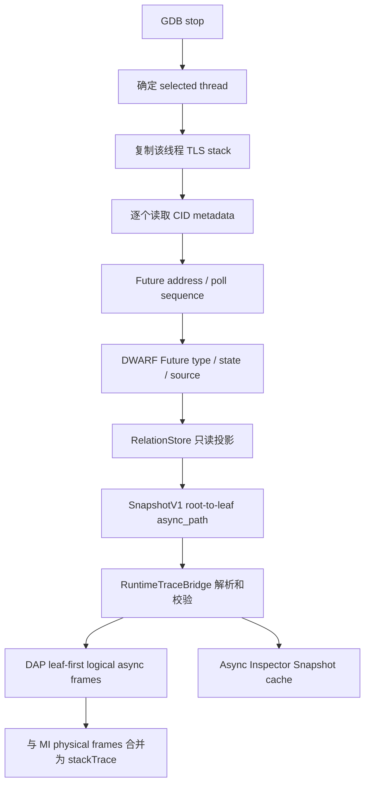
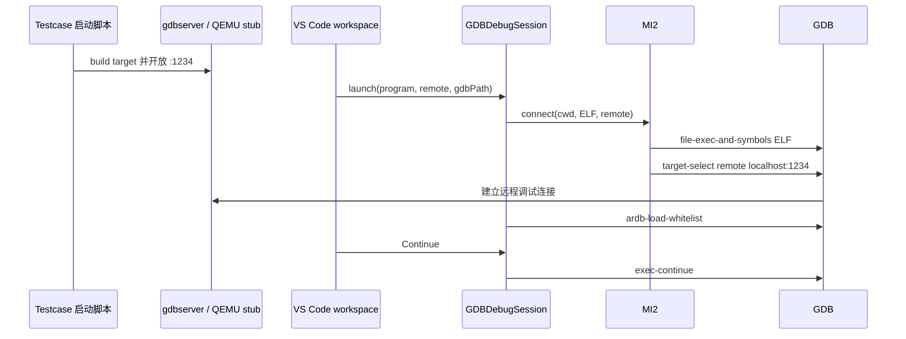
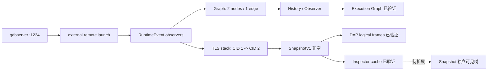
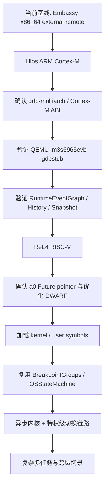

# ARD 调试器融合项目架构介绍

> 项目：Async Rust Debugger（ARD）  
> 分支状态：`async-integration/async-debug` 当前工作区  
> 文档日期：2026 年 7 月 27 日  

# 1. 项目简介

ARD（Async Rust Debugger）面向 Rust 异步程序以及采用异步执行模型的操作系统环境，目标是在现有源码级调试体系上恢复传统调试器难以直接表达的异步执行状态。项目保留 VS Code、DAP、GDB/MI 和目标平台调试能力，并在 GDB 运行现场建立 Future poll 观测、运行事件记录、逻辑关系重建和当前状态恢复机制，使调试结果不再局限于某一时刻的物理机器栈。

Rust 异步函数在编译后被转换为实现 `Future` 的状态机。执行器通过反复调用 `poll` 推进 Future；当 Future 返回 `Pending` 时，当前物理调用栈会退出，而 Future 的状态保存在对象内存中。下一次被唤醒时，执行器可能从另一段物理调用路径再次进入 `poll`。传统 backtrace 能准确反映暂停时的物理栈，却无法单独回答某个 Future 已经历多少次 poll、当前处于哪个状态、曾调用过哪些子 Future，以及暂停时逻辑上的异步父子关系。

ARD 解决的核心问题不是扩展函数列表，而是建立从调试控制事实到异步执行语义的连续数据链：



这条链路包含两类互补结果。RuntimeEventGraph 与 History 记录运行期间已经发生的事实，回答“异步程序此前执行过什么”；SnapshotV1 从暂停现场恢复当前线程仍然活跃的异步路径，回答“此刻哪些 Future 正在形成逻辑执行链”。Async Inspector 与 DAP logical frames 是这些事实的消费层，不承担事件推断和关系生成职责。

项目面向的长期场景包括普通 Rust async 程序、Embassy 等异步嵌入式框架、Lilos 异步微控制器环境，以及 ReL4 异步内核与用户态协同调试。当前阶段已经在 x86_64 Embassy std testcase 上完成 external remote、RuntimeEventGraph、History、SnapshotV1、DAP logical frames 和 Execution Graph 的运行验证；ARM Lilos 与 RISC-V ReL4 尚处于后续环境扩展阶段。

# 2. 整体架构设计

当前融合架构以 main 分支的既有主调试框架为控制基础，将异步运行状态观测能力纳入同一调试会话。系统不是两个调试器的并行拼接，也没有保留第二套 adapter、session 或 GDB 控制入口。所有用户操作仍由 `type: "ardb"` 的 DAP 会话处理，异步模块通过同一 GDB 进程内的 Python 扩展采集运行事实，再由同一 TypeScript session 提供给 DAP 和 Inspector。

主调试框架负责与目标程序交互的控制职责，包括：

- VS Code Debug Adapter Protocol 请求处理；
- GDB/MI2 进程管理和命令调度；
- 源码断点、函数断点、continue、step、pause 和 stackTrace；
- 本地 launch、external remote launch 与原有 attach；
- 面向操作系统调试的 BreakpointGroups；
- 描述内核态、用户态及其切换行为的 OSStateMachine。

融合后的异步能力负责运行状态观测与逻辑链恢复，包括：

- whitelist 管理和 RuntimeEvent breakpoint 安装；
- Future poll enter/exit 生命周期记录；
- CID、Future address、poll sequence 与 DWARF 状态元数据；
- RuntimeEventGraph 与 History Tree；
- Trace Root 和 Observer Tree；
- SnapshotV1、关系投影和 DAP logical async frames；
- Async Inspector 的 Execution Graph 数据消费与 Snapshot 请求缓存。

整体职责可以表示为：



该设计遵循两个原则。

第一，调试控制与异步观测分离。continue、step、远程连接、断点生命周期和 inferior 状态由主调试框架统一管理；`runtime_trace.py` 不创建另一条 launch 流程，不接管 QEMU 或 gdbserver，也不替代 MI2。这样能够保持现有 OS 调试骨架、BreakpointGroups 和 OSStateMachine 的行为边界。

第二，历史事实与当前状态分离。RuntimeEventGraph 是累计事实存储，History 和 Observer 从它投影；SnapshotV1 则读取暂停时的 per-thread live facts。两条数据链共享 RuntimeEvent observer 提供的 CID、符号和 Future 信息，但 Snapshot 不从 History JSON 反向生成，History 也不依赖 Snapshot 是否成功。

融合过程中，Debugger-2 的价值体现在异步运行观测设计和相关数据模型，而不是其旧调试入口。旧 adapter/session、testcase launch、独立 GDB 控制逻辑和旧 async tree 流程没有进入当前架构。对于 Embassy、Lilos 和 ReL4，旧仓库的构建参数、QEMU 参数、ELF 路径和 gdbstub 启动方式可作为 testcase 环境资料，ARD 调试会话仍由当前统一架构负责。

# 3. 系统核心数据流

## 3.1 调试控制链

调试控制链负责把 VS Code 中的用户操作转化为 GDB/MI 命令，并将目标停止、线程、栈帧和断点结果返回给编辑器。其稳定性决定所有异步观测是否具备可靠运行现场。



`GDBDebugSession` 是统一会话协调者。它处理 launch/attach 配置，维护当前 transport、inferior 是否已经启动、OS 调试是否启用，并把源码断点映射为 GDB breakpoint。MI2 backend 负责 GDB 子进程、MI token、结果解析和命令顺序，不包含 RuntimeEventGraph 或 Snapshot 业务语义。

本地 launch、external remote launch 和 attach 共用同一 session，但传输与 OS 调试状态显式分离：

| 模式 | Transport | 目标生命周期 | OS 调试 | 首次运行语义 |
|---|---|---|---|---|
| local launch | local | ARD/GDB 启动本地程序 | 关闭 | `exec-run` |
| external remote launch | remote | 外部 testcase 拥有 | 关闭 | `exec-continue` |
| 原有 attach | remote | ARD 按 attach 配置启动 QEMU | 开启 | `exec-continue` |

external remote launch 通过明确的 `transport=remote` 与 `enableOsDebug=false` 表达“连接既有 gdbserver，但不启用 OS 切换逻辑”。原 attach 使用 `transport=remote` 与 `enableOsDebug=true`，继续初始化 OSStateMachine 和 BreakpointGroups。该分离避免通过是否存在 attach 配置间接推断 transport 或 OS 语义。

## 3.2 异步观测链

异步观测链存在的原因，是 Future 的逻辑生命周期不能完全由普通源码断点推导。ARD 根据 whitelist 在 GDB 内安装内部 RuntimeEvent breakpoint，使每次目标 poll 命中时都能形成结构化事实。



runtime_trace 判断“哪个 Future 进入 poll”时，首先取得命中的 poll symbol，再通过 `FuturePointerResolver` 按目标 ABI 读取 poll 的第一个参数。对当前已验证的 x86_64 SysV 环境，该参数来自 `$rdi`。随后系统以 poll symbol 与 Future address 的组合建立协程实例身份，并分配 CID。将 symbol 纳入身份键可以避免不同 poll 语义因共享或接近的对象地址而被错误合并。

poll 进入时，observer 增加该 CID 的 poll sequence，采集可获得的 DWARF Future type 与状态字段，记录 `call_enter`，并把 CID 压入当前 GDB thread 对应的 TLS 逻辑栈。这里的 TLS stack 是调试器维护的 per-thread 异步嵌套状态，不等同于目标机器的 native stack。

poll 退出由内部 FinishBreakpoint 观察。退出事件写入 `call_exit`，同时从 call stack 和 TLS stack 中移除相应 CID。该设计使 History 可以保留已经发生的 enter/exit，而 Snapshot 仅在 poll 尚未退出的暂停窗口中看到活跃 CID。

父子关系主要通过同线程 call stack 建立。当子 poll 命中时，当前 call stack 顶部提供父 RuntimeEvent；系统记录 parent/child、CID、线程、事件编号及来源。对于需要更强 await 语义的关系，ARD 还可以利用父 Future 的活动变体、awaitee address/type 和 runtime child hit 进行验证，将通过校验的关系写入有界 RelationStore。RuntimeEventGraph 的执行边与 Snapshot 中的 observed await relation是不同强度的事实：前者表示运行时调用拓扑，后者要求更严格的 Future 关系证据。

## 3.3 历史调用链

RuntimeEventGraph 保存调试会话期间已接受的运行事件，包括节点、边、根、enter/exit 计数、活动计数、事件序列和部分关系注释。其作用是使 Future suspend 后已经消失的物理调用关系仍能被查询。



History Tree 表示已经发生过的执行关系。节点不会因为一次 poll 返回就从 History 中删除；相应的 active count 和 exit count会发生变化。这样既能描述“曾经调用”，也能标识查询时仍处于活动状态的节点。

History 与 Snapshot 在时间语义上严格区分：

- History 面向运行期间累计事实，可以在相关 Future 已 suspend、物理栈已退出后继续保留节点和边；
- Snapshot 面向单次 GDB stop，只读取当前线程 live TLS path；
- History 不由 Snapshot 生成，也不会因为 Snapshot 为空而丢失；
- Snapshot 不从 History 猜测当前活跃节点，避免把过去事件误表示为当前状态。

Async Inspector 的 Execution Graph 并不直接接收完整 History JSON。`ardb-get-observer-tree` 在 GDB 端读取同一 RuntimeEventGraph export，然后按 `ACTIVE_TRACE_ROOT` 选择一个 detached subtree。Panel 对该 subtree 做展示字段归一化，再发送到 webview。这一设计使 History 作为完整事实库，Observer 作为用户当前关注范围，两者职责明确。

## 3.4 当前状态恢复链

SnapshotV1 解决的是暂停瞬间的异步执行状态恢复。它必须在相关 poll 进入 observer 已执行、但 poll return observer 尚未执行的时间窗口内获取数据。



Snapshot builder 从 selected thread 对应的 `_TLS_STACK` 复制 CID 序列，然后为每个 CID生成节点。节点包含 Future address、Future type、poll sequence、state、status、diagnostics、源码位置、active 标志以及 `relation_from_parent`。relation projector 不修改 RelationStore，也不创造未经验证的 observed await；找不到匹配关系时会显式输出 `kind=unknown`、`confidence=unknown` 和空 evidence。

SnapshotV1 的 `async_path` 采用 root-to-leaf 顺序，适合表达异步父子结构。DAP stackTrace 需要把当前活动叶节点置于顶部，因此 `GDBDebugSession` 将该路径反转为 leaf-first logical frames，再在其后追加 MI 查询得到的 physical frames。Snapshot node 的 `physical=false` 表示逻辑帧；SnapshotV1 协议本身不包含 physical stack，物理栈仍由 GDB/MI提供。

History 表示过去，Snapshot 表示当前。二者结合后，调试者既能查看某条 async 链在运行期间的累计关系，也能在断点暂停时定位当前 active Future 和逻辑父节点。

# 4. 核心功能介绍

## 4.1 RuntimeEvent 异步事件捕获

RuntimeEvent 捕获机制是所有异步恢复能力的事实入口。它存在的原因是普通用户断点无法覆盖每次 Future poll，也无法在不改变程序源码的情况下持续记录 poll enter/exit。ARD 使用 workspace 的 whitelist 明确选择观测符号，在 GDB 中为这些符号安装内部 observer。

whitelist 承担运行观测边界控制。Rust 工程及其依赖可能包含大量 generic poll、执行器内部 helper 和同步函数；如果对所有候选符号安装 observer，会造成断点数量和事件噪声快速增长。当前机制支持 grouped whitelist 用于符号分类与选择，同时运行时加载 flat whitelist，确保最终 observer 集合可审查、可重复。

每个 RuntimeEvent 至少包含符号、CID、Future address、线程、poll sequence、程序计数器、事件来源和 whitelist admission 结果。进入事件写入 `call_enter`；poll 返回后写入 `call_exit`。父事件仍在同线程 call stack 时，子 poll 可形成执行边。该机制不依赖 testcase 脚本注入 breakpoint，也不要求修改被调试 Rust 源码。

Embassy std 验证使用最小 whitelist：

```text
tick::__run_task::__run_task_inner_function::{async_fn#0}
embassy_time::timer::{impl#5}::poll
```

运行结果形成：

```text
tick::__run_task::__run_task_inner_function::{async_fn#0}
  -> embassy_time::timer::{impl#5}::poll
```

observer 数量、符号解析、真实命中、call enter/exit 和 RuntimeEventGraph 节点/边均已完成运行验证。这说明 runtime_trace 能在真实外部 workspace 中识别用户 task Future 与 framework Future，而不是仅在内置 minimal testcase 上工作。

## 4.2 History Tree 调用关系重建

History Tree 解决异步执行关系在 Future suspend 后无法由当前物理栈继续观察的问题。传统 backtrace 对同步调用十分准确，但 Future 返回 `Pending` 后，相应函数帧退出，后续暂停点的物理栈可能主要由 executor、waker 和调度循环构成。若仅查看当下 backtrace，调试者无法完整了解此前出现过的 async parent/child。

ARD 在事件发生时写入 RuntimeEventGraph，而不是在查询 History 时依据符号名称临时推断。节点进入次数、退出次数、活动状态和边来源均来自真实运行事件。History export 将图结构组织为可查询的 roots、nodes、edges 和 events，并保留稳定 root 语义。Observer 再按 Trace Root 裁剪为当前关注子树。

这一功能的价值在于把“运行时发生过的调用关系”从物理栈生命周期中独立出来。调试者可以在 Future 已 suspend 后继续观察其历史子调用，并将 Execution Graph 与当前 Snapshot 对照。History 不替代 physical backtrace；它提供的是异步逻辑时间维度上的累计结构。

## 4.3 SnapshotV1 当前异步状态恢复

SnapshotV1 用于恢复 GDB stop 时仍活跃的 Future 路径。其输入是 per-thread TLS stack、CID metadata、Future address、poll sequence、DWARF type/state 和已验证关系记录。输出采用版本化协议，包含 session、generation、thread、empty 标志、transition、privilege 以及 async path。

Snapshot 的存在使调试器能够区分三种情况：当前没有活跃异步 poll；当前只有一个 active Future；当前存在父 Future 调用子 Future 的嵌套 poll。失败或暂不支持的元数据不会被填入默认成功值，而是通过 `status`、`error`、`source` 和 `confidence` 表达。

Embassy 在 `embassy-time/src/timer.rs:189` 暂停时，live TLS stack 为 `[1,2]`，SnapshotV1 成功恢复：

```text
run_task CID 1
  -> Timer::poll CID 2 (active leaf)
```

run-task Future 的 environment type和 `state=0` 由 DWARF 成功解析。Timer 节点身份、地址、poll sequence和 active 状态恢复成功；当前 state resolver 不覆盖其 `impl Future::poll` 符号形式，因此 Timer 的 type/state diagnostics 明确为 unsupported/unknown。首次 Timer poll 时 RelationStore 尚无 validator-approved record，子关系为 unknown，但两层 async path 已正确形成。报告对路径恢复与 observed await 关系强度进行了区分。

同一暂停点的 DAP stackTrace 产生 2 个 logical async frames，并保留 10 个 physical GDB frames，总计 12 帧。该结果证明 SnapshotV1 已进入调试器标准栈消费链，而不是停留在独立 JSON 文件中。

## 4.4 Async Inspector

Async Inspector 是面向用户的异步状态展示与交互层。它存在的原因是 RuntimeEventGraph、Observer 和 SnapshotV1 均属于结构化调试数据，直接阅读 GDB console JSON 不适合作为日常调试入口。Inspector 将当前 Trace Root、Execution Graph、whitelist 候选和节点导航组织在同一 VS Code webview 中。

当前 Execution Graph 路径已完成运行验证：Panel 调用 `ardb-get-observer-tree`，归一化节点后发布 `updateTreeView` 与 `updateTree`，webview 把 treeData 渲染为 root/children。Embassy 的实际 payload 为 run-task root 和 Timer poll child，与 RuntimeEventGraph History 的节点、边和所选 Observer root 一致。

Snapshot 按钮当前直接调用 `ardb-get-snapshot`，通过 RuntimeTraceBridge 获得 SnapshotV1，输出结构化日志并保存 `_lastSnapshot`，供 logical frame 选择与节点导航使用。当前生产 UI 没有把 Snapshot 发布为独立可见树：Snapshot 点击不会发送 `updateTree`，也不会调用已存在但未接入活动路径的 `buildCurrentExecutionForest()`。因此应准确表述为“Inspector 已消费 Snapshot 数据，Execution Graph 已可视化；Snapshot 独立树视图仍是后续展示扩展”。

这一边界不影响核心数据链的有效性。RuntimeEvent、History、Snapshot 和 DAP logical frames 的生成均在展示层之前完成；UI 不参与 CID 分配、关系建立或状态解析。后续增加 Snapshot 可见视图时，应消费既有 SnapshotV1，不应在前端重新实现异步关系推断。

# 5. External Remote Launch 设计

external remote launch 用于连接由 testcase 或目标平台工具提前启动的 gdbserver、QEMU gdbstub 或硬件调试服务器。引入该模式的原因是不同 Rust 异步运行环境拥有不同的启动方式：Embassy std 使用 native gdbserver；Lilos 使用 ARM QEMU；ReL4 使用特定 RISC-V QEMU、boot image、SMP 和 CPU 参数。若由 ARD 内部统一创建这些环境，会把调试器与 testcase 构建系统及平台启动参数绑定。

当前配置形式为：

```json
{
  "type": "ardb",
  "request": "launch",
  "program": "/path/to/app.elf",
  "remote": "localhost:1234",
  "gdbPath": "gdb"
}
```

其中 `program` 用作 ELF symbol file，`remote` 是已存在的 GDB server endpoint，`gdbPath` 允许选择目标所需的 GDB executable。ARD 不启动 QEMU，不启动 gdbserver，也不拥有 inferior lifecycle。



该模式带来三项架构收益。

其一，目标启动与调试控制分离。testcase 脚本负责 build、镜像准备、QEMU/gdbserver 和端口；ARD 负责符号、断点、RuntimeEvent、History、Snapshot 和 Inspector。

其二，ARD 不绑定特定 OS 启动方式。新增平台时优先提供正确 ELF、source workspace、GDB executable 和 remote endpoint，不需要创建另一套 debug adapter。

其三，原有 local launch 与 attach 行为保持。local launch 继续使用 MI2.load 和首次 `exec-run`；attach 继续负责 QEMU、OSStateMachine 与 BreakpointGroups；external remote 使用 MI2.connect 和 `exec-continue`，同时关闭 OS debug。后续 ReL4 若需要 external transport 与 OS debug 的新组合，应在现有显式状态模型上评审扩展，而不是恢复旧 Debugger-2 session。

# 6. Embassy std 适配成果

Embassy std 是当前第一个完成融合架构运行验证的外部真实 workspace。目标程序为 `/home/user/embassy/examples/std/target/debug/tick`，运行环境是 x86_64 Linux native，testcase 侧使用 `gdbserver :1234`，ARD 从 `/home/user/embassy` workspace 通过 external remote launch 连接。

## RuntimeEvent

当前 flat whitelist 仅包含 run-task 与 Timer poll 两个符号。ARD 成功加载 2 个 observer，两个 breakpoint 均有效且完成地址解析。运行时捕获了真实 create、classify、ALLOW、call_enter，并在 RuntimeEventGraph 中记录 enter/exit 生命周期。

最终累计验证得到：

```text
RuntimeEventGraph / History
nodes = 2
edges = 1

tick::__run_task::__run_task_inner_function::{async_fn#0}
  -> embassy_time::timer::{impl#5}::poll
```

这证明 external workspace temp、whitelist、GDB Python runtime、Future pointer、CID 和图写入链可以共同工作。

## Snapshot

为确保 Snapshot 查询处于有效 live window，验证没有使用存在多个 DWARF location 的 `tick.rs:8`，而是在 `embassy-time/src/timer.rs:189` 设置源码断点。该位置位于 Timer poll 进入之后、返回 `Pending` 之前。

命中后：

```text
TLS stack = [run CID 1, Timer CID 2]
SnapshotV1.version = 1
SnapshotV1.empty = false
async_path.length = 2
```

Snapshot 恢复 run-task parent 与 active Timer leaf，并经 RuntimeTraceBridge 进入 DAP stackTrace。logical frame 顺序为 Timer、run-task，随后保留真实 physical frames。由此确认“GDB stop → TLS/CID/Future → SnapshotV1 → logical async frames”的数据链已成立。

## Inspector

Inspector 的 Trace Root 选择已成功设置为 run-task。停止时，History、Observer export 和 Panel 发布的 treeData 在节点身份及拓扑上保持一致，Execution Graph 展示：

```text
run_task
  └─ Timer::poll
```

Snapshot 按钮能够获取同一暂停点的非空 SnapshotV1，并将其完整缓存到 Inspector；当前未提供 Snapshot 独立可见树，因此不能宣称 Inspector 已显示 Timer/run-task Snapshot 列表。

Embassy 的验证结论应表述为：ARD 已完成从 external remote 连接、RuntimeEvent 捕获、RuntimeEventGraph/History 重建，到 Execution Graph 展示的运行闭环；同时完成从暂停现场、SnapshotV1 到 DAP logical frames和 Inspector Snapshot cache 的当前状态恢复闭环。若项目验收把“Snapshot 独立 webview 树”纳入完整 UI 闭环，该展示环节仍待后续接入。



# 7. 当前支持能力与边界

当前项目已经形成统一架构下可运行的异步调试基础。已完成能力包括 Rust async poll 符号观测、whitelist 控制、Future pointer 与 CID 身份管理、poll enter/exit 生命周期、RuntimeEventGraph 累计事实、History/Observer 投影、SnapshotV1 当前状态恢复、DAP logical/physical stack 合并、Execution Graph 展示，以及 Embassy std external remote 运行验证。

为了区分“代码存在”和“平台已验证”，当前能力可以按以下层级说明：

| 能力 | 当前状态 | 验证范围 |
|---|---|---|
| DAP/GDB/MI 调试控制 | 已完成 | local、attach 既有路径；external remote 已实跑 |
| BreakpointGroups / OSStateMachine | 保持主框架能力 | 本轮 Embassy 不启用 OS debug |
| RuntimeEvent poll 捕获 | 已完成并验证 | minimal、Embassy x86_64 |
| RuntimeEventGraph / History | 已完成并验证 | Embassy 2 nodes / 1 edge |
| Trace Root / Observer | 已完成并验证 | Embassy run-task subtree |
| SnapshotV1 | 已完成并验证 | Embassy 两层 async path |
| DAP logical async frames | 已完成并验证 | Embassy 2 logical + 10 physical |
| Inspector Execution Graph | 已完成并验证 | Embassy run-task → Timer |
| Inspector Snapshot 请求/cache | 已完成并验证 | 与直接 Snapshot 对象一致 |
| Inspector Snapshot 独立可见树 | 尚未接入活动 UI | 作为后续展示扩展 |
| Lilos ARM runtime | 尚未运行验证 | 后续跨架构阶段 |
| ReL4 跨特权级 async 链 | 尚未融合验证 | 后续 OS 深化阶段 |

当前边界不改变项目技术路线。Lilos 与 ReL4 的主要工作不应重新实现 RuntimeEventGraph、History 或 Snapshot，而应验证目标 ABI、GDB 架构、DWARF 可用性、QEMU/gdbstub 参数、source mapping 和停止点稳定性。

跨架构方面，Future pointer resolver 必须按目标 ABI读取首参数。x86_64 Embassy 已验证 `$rdi` 路径；ARM Cortex-M 与 RISC-V 需要分别确认寄存器约定和 GDB architecture name。跨特权级方面，ReL4 还需要把 kernel/user symbol、BreakpointGroups、OSStateMachine transition 事实与 async observer 数据关联，当前不能将 `privilege=unknown` 描述为已恢复的内核/用户态语义。

复杂 OS 场景还可能涉及优化构建下的 DWARF 缺失、同一源码行多个 location、PIE/重定位、多个线程或 CPU 上的 Future 调度、执行器 generic poll 噪声以及不同地址空间的符号加载。这些属于后续平台适配需要验证的工程条件。现有协议通过 status/error/source/confidence 保留失败诊断，能够在扩展过程中避免把未知状态误报为成功状态。

# 8. 后续发展路线

后续路线的重点是扩展运行环境并验证既有异步数据链，不是建立新的 async debugger 或复制 Debugger-2 旧功能。



第一阶段是 Lilos。testcase 侧应使用既定 ARM 构建目标和 QEMU `lm3s6965evb`/Cortex-M3 参数开放 gdbstub；真实 Lilos workspace 提供 ELF、源码和 `type: ardb` external remote 配置。ARD 侧重点验证 `gdb-multiarch` 选择、ARM 首参数寄存器、poll symbol 解析、源码映射，以及 RuntimeEventGraph、History 和 SnapshotV1 在 Cortex-M 上是否保持同一协议语义。通过该阶段可以确认异步观测链从 host x86_64 扩展到嵌入式跨架构环境。

第二阶段是 ReL4。testcase 启动层继续负责定制 RISC-V QEMU、`virt` machine、特定 CPU、SMP、boot image 和 `:1234` gdbstub。ARD 需要验证 RISC-V `$a0` Future pointer、release debug-info、内核与用户态符号装载、source root、异步 syscall或任务 Future 的 RuntimeEvent。随后在不改变 OSStateMachine 与 BreakpointGroups 架构的前提下，评估 external transport 如何启用既有 OS debug 事实，并把 privilege transition 作为 Snapshot/History 的可信元数据来源。

第三阶段是复杂场景深化，包括多线程 executor、多个 CPU、Future 跨线程唤醒、嵌套 async syscall、内核与用户态分别 suspend/resume，以及更长时间 History 的容量和查询策略。该阶段需要以 RuntimeEvent 的真实 thread/CPU/privilege 事实为基础，不能由 UI 或符号名称推断。

展示层后续可在不改变 SnapshotV1 协议的前提下恢复 Snapshot 独立视图，将 root-to-leaf Snapshot path转换为清晰的当前状态树或 logical frame列表，并保持与 Observer Execution Graph 分离。该扩展应继续遵循“后端负责事实与关系，前端负责展示和导航”的原则。

综上，ARD 当前已经建立统一调试控制、异步运行观测、累计 History、暂停态 Snapshot和 Execution Graph 的架构基础，并通过 Embassy std 证明两条核心数据链能够在真实 external workspace 中运行。后续工作的主要风险和投入集中在目标架构 ABI、平台启动、符号与 DWARF、特权级事实和复杂调度环境，而不是重新设计 RuntimeEventGraph 或 Snapshot 协议。
